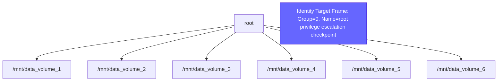
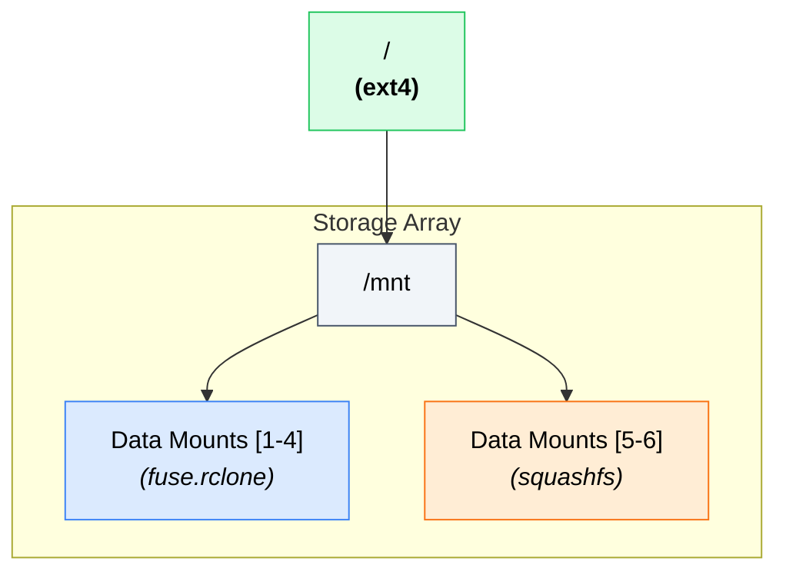
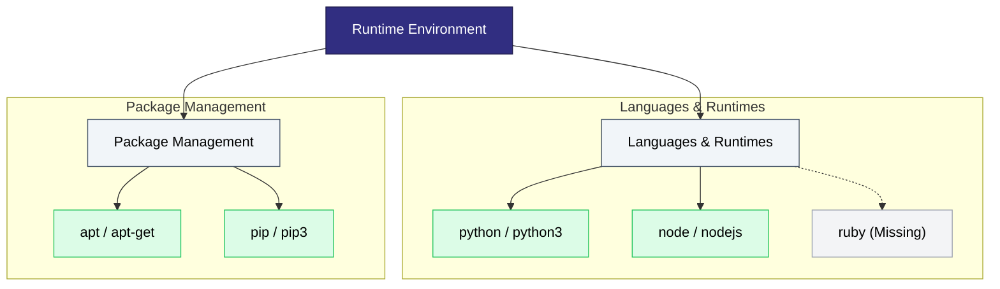

# Mermaid Diagram Architecture & Style Standards

## 1. Executive Summary & Core Directive

When generating structural or technical visualisations using Mermaid, systems must optimise for immediate human scannability, accessibility, and high spatial efficiency. Diagrams are frequently consumed on landscape-oriented viewports (monitors, laptops) or scaled significantly downward on mobile devices.

**Core Imperative:** Never output an unstructured "hairball" or a massive, single-line linear sequence that forces infinite horizontal or vertical scrolling. Diagrams must remain compact, responsive, and legible on relatively small displays.

---

## 2. Layout & Spatial Dimension Rules

### A. Context-Aware Flow Direction

* **`graph TD` (Top-Down):** Use as the default orientation for hierarchical trees, directory/mount maps, organisational layouts, and categorised architecture hubs. Top-down architectures cluster horizontal elements gracefully, scaling cleanly downward with normal page text flow.
* **`graph LR` (Left-to-Right):** Restrict usage strictly to multi-step linear pipelines, sequential data lifecycles, or logical workflows containing fewer than 5 total sequential nodes.

### B. Viewport Conservation & Sizing Limits

* **Horizontal Sibling Threshold:** Never allow more than 4 to 5 sibling nodes to stretch freely across the horizontal axis under a single parent node.
* **Categorisation Hubs:** If a specific structural group exceeds 4 nodes, group them logically into functional **Subgraphs** or compress related aliases into a single element (e.g., instead of mapping two separate nodes for `python` and `python3`, merge them into a single `python / python3` node).
* **Text Wrapping & Node Layout:** Always use HTML `<br>` tags manually inside strings to control dimensions. Raw `\n` is handled unpredictably across different markdown viewers, frequently causing text to clip outside node boundaries. Keep text compact to allow the diagram to shrink gracefully on narrow screens.

---

## 3. High-Contrast Accessibility Palette

To ensure clear legibility across dark, light, and low-end mobile screens, follow strict text-to-background contrast constraints. Use the following comprehensive library of custom `classDef` utilities.

### Standardised `classDef` Library

Apply these to any `flowchart` or `graph` diagram. Each colour has two variants to manage readability: standard dark text (`color:#000`) and white text (`color:#FFF`, suffixed with `white`).

```
%% Full Standardised Color Palette

classDef red fill:#FEE2E2,stroke:#EF4444,color:#000
classDef redwhite fill:#EF4444,stroke:#991B1B,color:#FFF
classDef lightred fill:#FEF2F2,stroke:#FCA5A5,color:#000
classDef lightredwhite fill:#FCA5A5,stroke:#991B1B,color:#FFF
classDef orange fill:#FFEDD5,stroke:#F97316,color:#000
classDef orangewhite fill:#F97316,stroke:#7C2D12,color:#FFF
classDef yellow fill:#FEF08A,stroke:#CA8A04,color:#000
classDef yellowwhite fill:#EAB308,stroke:#713F12,color:#FFF
classDef green fill:#DCFCE7,stroke:#22C55E,color:#000
classDef greenwhite fill:#22C55E,stroke:#14532D,color:#FFF
classDef teal fill:#CCFBF1,stroke:#0D9488,color:#000
classDef tealwhite fill:#0D9488,stroke:#115E59,color:#FFF
classDef blue fill:#DBEAFE,stroke:#3B82F6,color:#000
classDef bluewhite fill:#1D4ED8,stroke:#1E3A8A,color:#FFF
classDef indigo fill:#E0E7FF,stroke:#4F46E5,color:#000
classDef indigowhite fill:#312E81,stroke:#1E1B4B,color:#FFF
classDef purple fill:#F3E8FF,stroke:#9333EA,color:#000
classDef purplewhite fill:#9333EA,stroke:#581C87,color:#FFF
classDef pink fill:#FCE7F3,stroke:#EC4899,color:#000
classDef pinkwhite fill:#EC4899,stroke:#701A75,color:#FFF
classDef magenta fill:#FAE8FF,stroke:#D946EF,color:#000
classDef magentawhite fill:#D946EF,stroke:#701A75,color:#FFF
classDef brown fill:#F5EBE0,stroke:#8B5A2B,color:#000
classDef brownwhite fill:#8B5A2B,stroke:#4A2711,color:#FFF
classDef lime fill:#F0FDF4,stroke:#84CC16,color:#000
classDef limewhite fill:#84CC16,stroke:#365314,color:#FFF
classDef cyan fill:#ECFEFF,stroke:#06B6D4,color:#000
classDef cyanwhite fill:#06B6D4,stroke:#164E63,color:#FFF
classDef slate fill:#F1F5F9,stroke:#475569,color:#000
classDef slatewhite fill:#475569,stroke:#0F172A,color:#FFF
classDef grey fill:#F3F4F6,stroke:#9CA3AF,color:#000
classDef greywhite fill:#9CA3AF,stroke:#374151,color:#FFF
classDef black fill:#444444,stroke:#000000,color:#FFF
classDef blackwhite fill:#111111,stroke:#000000,color:#FFF

```

### Semantic Palette Mapping Quick-Reference

While the entire palette is available for specific visual workflows, the system should default to these functional mappings for data, system, and security state architectures:

| Class Name | Visual Target Finish | Text Color | System Mapping Definition |
| --- | --- | --- | --- |
| `:::indigowhite` | Deep Midnight Indigo | **#FFF (White)** | **Primary Anchor / Core Subject:** Root nodes, central identities being audited, or system origin points. |
| `:::red` | Pastel Rose | **#000 (Dark)** | **Critical Risk / High Privilege:** Writeable root filesystems, critical security vulnerabilities, execution blocks. |
| `:::orange` | Pastel Amber | **#000 (Dark)** | **Warning / Read-Only Layer:** Compressed filesystems (`squashfs`), unverified active filters, warning warnings. |
| `:::green` | Pastel Mint | **#000 (Dark)** | **Success / Standard Active:** Healthy environments, verified native configurations, valid binaries. |
| `:::blue` | Pastel Sky | **#000 (Dark)** | **User-Space Focus:** Custom home directories, custom user profiles, local context boundaries. |
| `:::slate` | Clean Soft Gray | **#000 (Dark)** | **Structural Header:** Intermediate path boundaries, grouping frames, abstract categorical hubs. |
| `:::grey` | Muted Ash Gray | **#000 (Dark)** | **Inactive / Absent:** Missing language modules, legacy code libraries, disconnected system paths. |

---

## 4. Visual Anti-Patterns to Prevent

* **The Orphan Variable Trap:** Do not assign a relationship from an undeclared structural node (e.g., `opt --> node_a` when `opt` itself has no defined parentage or node label). All branches must track logically back to the root node.
* **Overwhelming Sibling Rows:** Do not build flat arrays of dozens of components connecting to a single hub. Force logical structural tiers using subgraphs or text grouping.
* **Duplicated Visual Strings:** Look for duplicated string assets trailing with incremented indices (e.g., `binary1`, `binary2`). Consolidate these paths cleanly or consolidate them within a unified multi-value category node.
* **Ambiguous Node Linkers:** Do not use plain undirected connector lines (`---`) when diagramming system execution flows, security relationships, or infrastructure trees. Always use explicit directional arrows (`-->`) or logical conditional linkages (`-.->`).

---

## 5. Blueprint Implementations

### A. Infrastructure Mapping Blueprint

#### Bad Architecture (Too wide, unbounded text strings, illegible contrast)



#### Good Architecture (Compressed Horizontal Plane, High Contrast, Categorised)



### B. System Availability Blueprint

#### Good Architecture (Multi-Category Subgraph Clustering)

